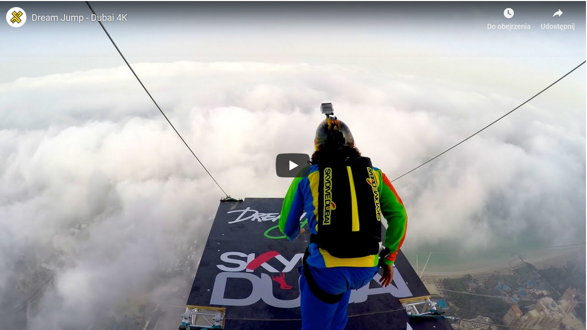

## Youtube with preloading image

What the project does - it's the educational part

* youtube embedded in html
* before loading youtube it shows preloading img in the middle of content

#### image from the repository

#### image random

